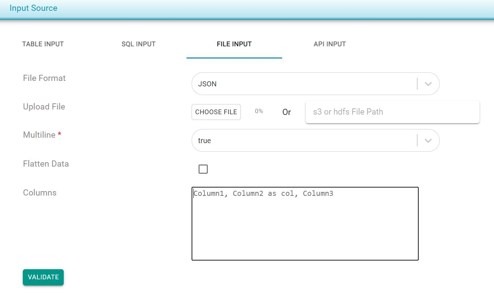

# Json


* JSON files can be added by choosing a file using upload option or specifying a s3 path  \(**s3a**://&lt;file\_path&gt;\) or HDFS location.
* Multiline option can be set to false if the JSON structure is in single line. Default value for this is set to true
* JSON can be flattened if the JSON structure is in hierarchical format. Flatten data check box should be selected to enable this option.
* JSON elements can be selected by specifying element names in the columns section and can be renamed using  as keyword. For eg if id, first\__name and last\_name are the only three elements to be selected from a JSON with many distinct elements: isbn as id, author.firstName as first\_name and  author._lastName as last\_name

```text
#multi line false
{ "isbn": "123-456-222","lastname": "Doe","firstname": "Jane"}
{"isbn": "123-456-777","lastname": "Smith","firstname": "Jane"}
```

```text
#multi line true
[
	{ "isbn": "123-456-222","lastname": "Doe","firstname": "Jane"},
	{"isbn": "123-456-777","lastname": "Smith","firstname": "Jane"}
]
```




 
